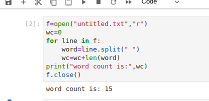

# Word-count
## AIM:
To write a python program for getting the word count from a text.
## EQUIPEMENT'S REQUIRED: 
PC
Anaconda - Python 3.7
## ALGORITHM: 
### Step 1:

Create a txt file to count the number of word in that file.

### Step 2:

 Open the txt file in read mode using open().
 
### Step 3:

Using split() function to split the words in the txt file and count it.


### Step 4:  

Save the python program using .py extention.

### Step 5: 

Run the python program in terminal to get the output.

### Step 6: 

Number of words in the txt file is displayed as the output.

## PROGRAM:
```python
write a program for getting the word count from a text.
#developed by:Mathiyazhagan.A
#reference no: 22005215

f=open("sample1.txt","r")
wc=0
for line in f:
    word=line.split(" ")
    wc=wc+len(word)
print("word count is:",wc)
f.close()

```

### OUTPUT:




## RESULT:
Thus the program is written to find the word count from a text.
